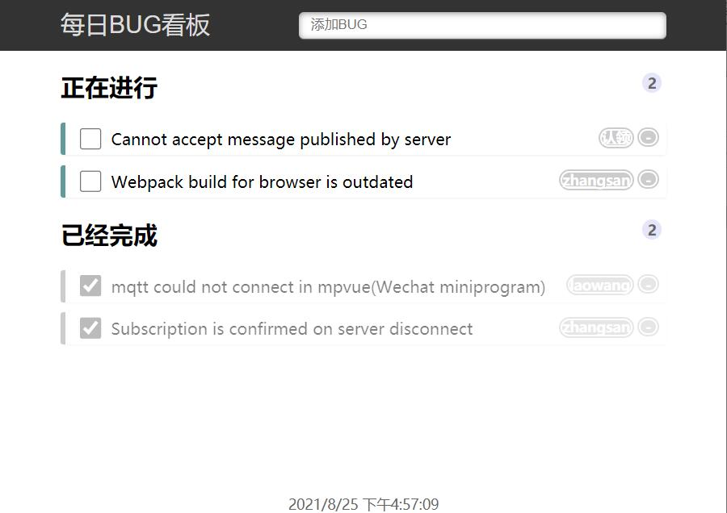
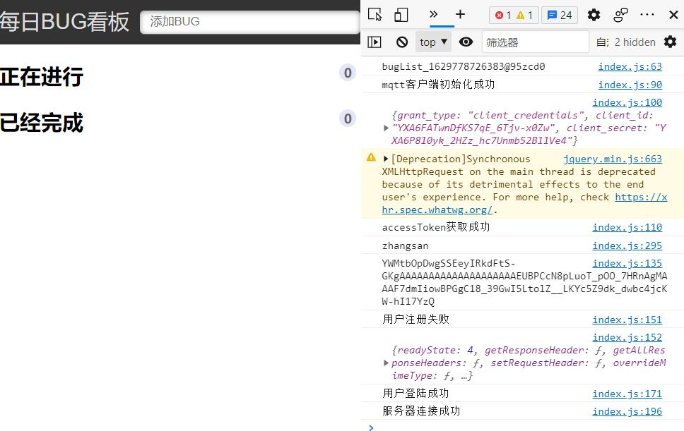
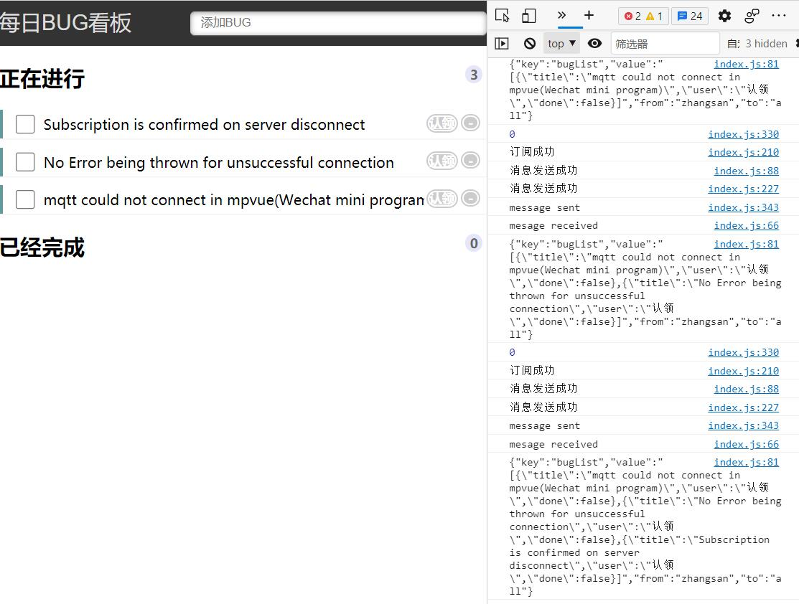
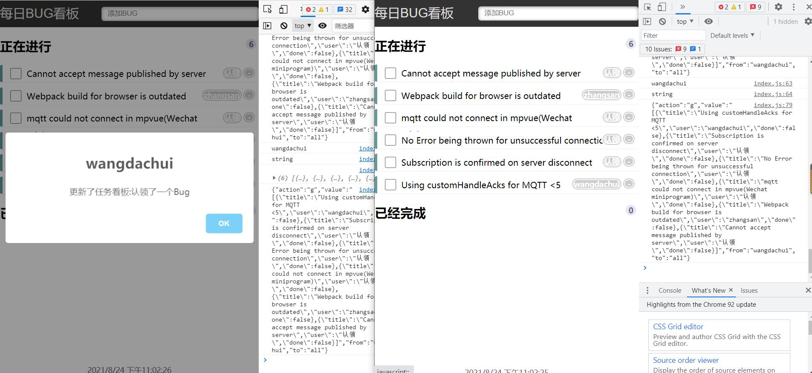
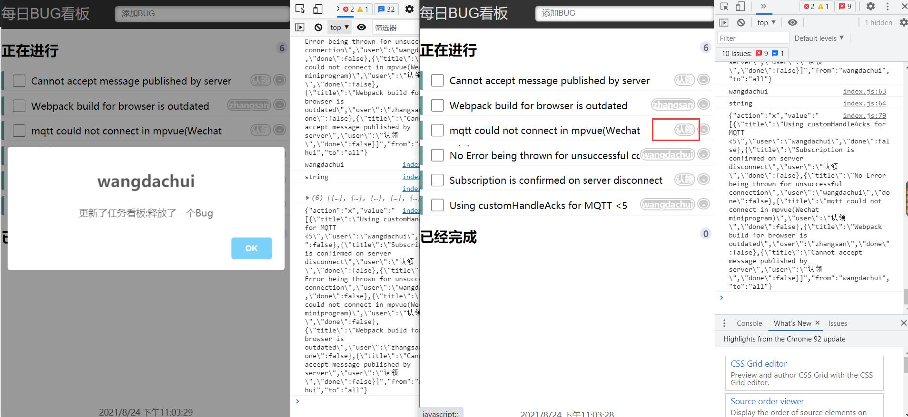
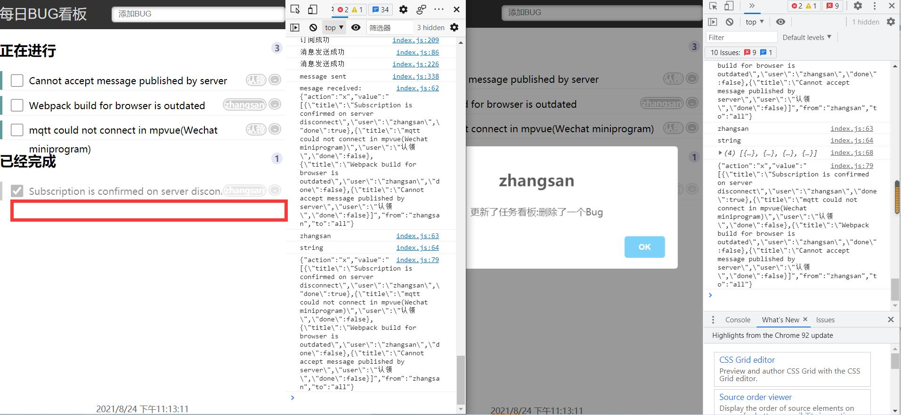
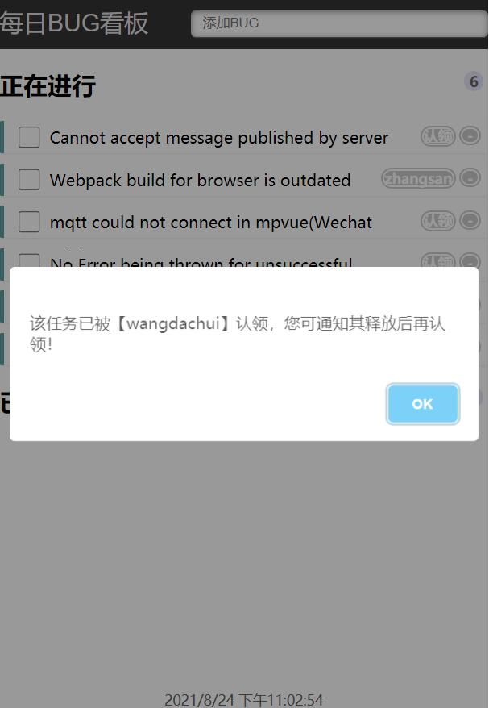

[](https://raw.githubusercontent.com/modood/Administrative-divisions-of-China/master/LICENSE)
[](https://travis-ci.org/supmaster/Creative-Challenge-MQTT-BugList) 


<!-- PROJECT LOGO -->
<br />
<p align="center">
  <a href="https://github.com/supmaster/Creative-Challenge-MQTT-BugList">
    
  </a>

  <h3 align="center">MQTT-TaskBoard</h3>

  <p align="center">
    基于环信MQTT开发的Serverless任务看板程序
    <br />
    <strong>任务看板 一眼尽览</strong>
    <br />
    <!-- A serverless product helps your team to deal with daily tasks, witch is based on Easemob MQTT !
    <br /> -->
    <a href="https://github.com/supmaster/Creative-Challenge-MQTT-BugList/blob/main/README_en.md"><strong>Docs for English version »</strong></a>
    <br />
    <br />
    <a href="https://github.com/supmaster/Creative-Challenge-MQTT-BugList" title="纯前端key没有加密，暂无演示，配置好key即可使用">查看演示</a>
    ·
    <a href="https://github.com/supmaster/Creative-Challenge-MQTT-BugList/issues">Bug 提交</a>
    ·
    <a href="https://github.com/supmaster/Creative-Challenge-MQTT-BugList/issues">想法交流</a>
  </p>
</p>

<!-- TABLE OF CONTENTS -->
<details open="open">
  <summary><h2 style="display: inline-block">索引</h2></summary>
  <ol>
    <li>
      <a href="#1-项目背景">1 项目背景</a>
      <ul>
        <li><a href="#1.1-大赛背景">1.1 大赛背景</a></li>
        <li><a href="#1.2-赛道赛题">1.2 赛道赛题</a></li>
        <li><a href="#1.3-应用背景">1.3 应用背景</a></li>
          <ul>
            <li><a href="#1.3.1-应用现状">1.3.1 应用现状</a></li>
            <li><a href="#1.3.2-开发测试痛点">1.3.2 开发测试痛点</a></li>
            <li><a href="#1.3.3-小团队成本问题">1.3.3 小团队成本问题</a></li>
          </ul>
      </ul>
    </li>
    <li>
      <a href="#1.4-适用对象">1.4 适用对象</a>
      <a href="#1.5-应用领域">1.5 应用领域</a>
      <ul>
        <li><a href="#1.5.1-开发测试">1.5.1 开发测试</a></li>
        <li><a href="#1.5.2-教育教学">1.5.2 教育教学</a></li>
        <li><a href="#1.5.3-会议室预定">1.5.3 会议室预定</a></li>
        <li><a href="#1.5.4-工单处理">1.5.4 工单处理</a></li>
        <li><a href="#1.5.5-经营管理">1.5.5 经营管理</a></li>
        <li><a href="#1.5.6-对口扶贫">1.5.6 对口扶贫</a></li>
        <li><a href="#1.5.7-个人待办">1.5.7 个人待办</a></li>
      </ul>
    </li>
    <li><a href="#2-功能介绍（以Bug List为例）">2 功能介绍（以Bug List为例）</a></li>
      <ul>
        <li><a href="#2.1-系统功能">2.1 系统功能</a></li>
          <ul>
            <li><a href="#2.1.1-配置说明">2.1.1 配置说明</a></li>
            <li><a href="#2.1.2-用户登录">2.1.2 用户登录</a></li>
          </ul>
        <li><a href="#2.2-业务功能">2.2 业务功能</a></li>
          <ul>
            <li><a href="#2.2.1-创建Bug">2.2.1 创建Bug</a></li>
            <li><a href="#2.2.2-认领Bug">2.2.2 认领Bug</a></li>
            <li><a href="#2.2.3-取消认领Bug">2.2.3 取消认领Bug</a></li>
            <li><a href="#2.2.4-解决Bug">2.2.4 解决Bug</a></li>
            <li><a href="#2.2.5-Bug复测不过">2.2.5 Bug复测不过</a></li>
            <li><a href="#2.2.6-删除Bug">2.2.6 删除Bug</a></li>
          </ul>
        <li><a href="#2.3 异常提示">2.3 异常提示</a></li>
          <ul>
            <li><a href="#2.3.1-认领他人Bug">2.3.1 认领他人Bug</a></li>
            <li><a href="#2.3.2-解决未认领Bug">2.3.2 解决未认领Bug</a></li>
          </ul>
      </ul>
    <li><a href="#3-技术组件">3 技术组件</a></li>
    <li><a href="#4-快速上手">4 快速上手</a></li>
    <li><a href="#5-开源协议">5 开源协议</a></li>
    <li><a href="#6-联系作者">6 联系作者</a></li>
    <li><a href="#7-致谢">7 致谢</a></li>
  </ol>
</details>

<!-- ABOUT THE PROJECT -->
## 1 项目背景



任务看板用于小团队协同管理日常任务，包括任务创建、任务认领、任务释放、任务解决、任务删除等操作，基于MQTT云服务，实现团队间实时同步推送。界面简洁、功能实用！

<!-- event-background -->
### 1.1 大赛背景
*  随着云通讯行业持续增长，5G建设逐步推进、音视频技术快速迭代，都是为了满足人与人、设备与人、设备与设备之间的消息传输。这无疑是一个消息传输的时代。在这个时代中，所有的协议、配置都在于恰到好处。正如MQTT消息传输协议基于物联网，但又不局限于物联网，同样可以在移动互联网中承担多种功能。
*  MQTT是一个极其轻量级的发布/订阅消息传输协议，它解除时间与空间耦合，可以在应用内实现推送、通知等功能；它简约、轻量，极小的SDK空间占用，适用于嵌入Android、iOS、RTOS等多端平台；它数据包小、功耗低，适用于低带宽、高延迟或不可靠的网络环境。
*  环信MQTT消息云的产品定位就是充分发挥MQTT协议优势，为开发者提供应用与应用之间、设备与应用之间、应用与平台之间的消息传输服务。为了让大家更深入了解MQTT协议优势，环信举办本次MQTT创意挑战赛，诚邀广大开发者通过编程实战，实际感受MQTT协议在应用间消息传输的优势。
*  为助力本次活动，MQTT消息云特提供两个月限免期！！大家可以肆意发挥idea进行创作，期待大家通过MQTT消息云，实现更多有趣的功能，挖掘更新奇的场景！

<!-- event-task -->
### 1.2 赛道赛题
#### 1.2.1 创意挑战赛
* 本赛道采用开放命题，不限开发语言与平台。参赛作品使用环信MQTT消息云相关技术并遵循相关设计、开发指南与规范。可以对日常生活、交通运输、医疗、教育、公共安全、公益等行业领域进行探索，并最终交付能够进行可视化应用展示的参赛作品 demo及源码。
* 开发完成后，将作品源码提交至个人 GitHub 仓库，仓库命名为 -Creative-Challenge-作品名，在Readme 文档中描述项目介绍、使用说明，然后将Github地址回复在本帖下方。
* 环信将组织评审专家对作品进行评审，包括但不限于作品的完成度、创新性、实用性、普适性、社会效益、商业价值等因素。

<!-- application-background -->
### 1.3 应用背景

#### 1.3.1 应用现状
对小团队来说，为此单独开发一套系统成本太高；使用Excel管理一是操作繁琐，二是无法实时同步给其他成员；使用企业微信、钉钉等社交软件，缺乏专业性，不便于直观了解整体情况。
#### 1.3.2 开发测试痛点
任务管理虽然是很常见的需求，如果纯依靠人工势必造成管理混乱、疏忽遗漏、管控不严，而数字化是一个很好的解决方案。

Bug管理作为一种典型的任务管理类需求，在小团队项目开发测试过程中，每天会有很多BUG被提出并需要协作解决。微信、钉钉虽然能解决部分问题，但是为了更好更直观的跟踪、梳理每日BUG，我们需要一个共享的看板。上面展示着当天需要处理的BUG，并在团队每个成员间实时同步。一方面展示BUG详情、完成情况，另一方面查看团队成员贡献情况，从而极大提高工作效率和团队管理水平。
#### 1.3.3 小团队成本问题
对小团队来说，最佳解决问题的方案，就是在满足需求的前提下成本最低。包括最少的开发工作，最小的系统开销，尽量小的服务器需求、最好免费使用。

<!-- GETTING STARTED -->
### 1.4 适用对象
* 项目开发测试人员
* 教师
* 客服
* 客户经理
* 政务工作人员
* 个人、情侣

### 1.5 应用领域
#### 1.5.1 开发测试
每日Bug创建、认领、修复记录
#### 1.5.2 教育教学
可用于选课，毕业设计、课程设计选题
#### 1.5.3 会议室预定
认领功能可应用于会议室预定，用完后释放，其他人可以再预定，完成功能可改为会议室维护
#### 1.5.4 工单处理
实现工单录入、认领、处理等工作
#### 1.5.5 经营管理
协助客户经理处理客户问题
#### 1.5.6 对口扶贫
扶贫事务经常需要分配扶贫对象的问题，可通过该任务看板进行在线选择
#### 1.5.7 个人待办
也可作为个人待办应用

<!-- USAGE EXAMPLES -->
## 2 功能介绍（以Bug List为例）
### 2.1 系统功能
#### 2.1.1 配置说明
* 配置文件在js/index.js中，同一协作团队MQTT配置须一致
* 部署方式没有要求，**联网环境**使用即可
* 推荐Chrome、Firefox、Edge等现代浏览器
#### 2.1.2 用户登录
* 打开页面首先需要登录，建议为本人姓名拼音或英文名
* 登录用户名必须为字母或数字，不允许其他字符
* 登录用户名的作用：
  * 作为创建、认领、解决、删除等操作的执行人，会展示在团队通知中
  * 用户MQTT服务注册，用户注册后才能订阅MQTT服务，MQTT要求用户名必须为字母和数字
* 登录页面后可以看到，页面分三部分：
  * 头部：系统名称、添加框
  * 上部：未解决的Bug
  * 下部：已解决的Bug
* 登录成功可以从console看到MQTT相关日志：
  * MQTT客户端初始化
  * 获取token
  * 用户注册（已注册用户提示注册失败，不影响）
  * 用户登录
  * MQTT客户端连接云端
 
### 2.2 业务功能
#### 2.2.1 创建Bug
* 直接在输入框输入Bug描述信息
* 回车即可添加到未解决目录下
* 创建成功后团队其他用户均可收到创建提醒
* 同时所有打开Bug看板的成员均会自动更新看板
* 
#### 2.2.2 认领Bug
* 查看未解决的Bugs
* 选择要认领的Bug，点击```认领```
* 认领后可以看到该Bug上显示自己用户名
* 团队其他用户均可收到认领提醒（该项不需要可以关闭）
* 同时所有打开Bug看板的成员均会自动更新看板


#### 2.2.3 取消认领Bug
* 查看未解决的Bugs
* 选择要取消认领的Bug，点击自己用户名标签
* 取消认领后即可释放该Bug，用户名标签自动改回```认领```
* 团队其他用户均可收到释放提醒
* 同时所有打开Bug看板的成员均会自动更新看板

#### 2.2.4 解决Bug
* 查看未解决的Bugs
* 选择自己已解决的Bug
* 点击前面的方框，将其状态改为已解决
* 该Bug将从```未解决列表```转移到```已解决列表```
* 团队其他用户均可收到解决提醒（该项不需要可以关闭）
* 同时所有打开Bug看板的成员均会自动更新看板

#### 2.2.5 Bug复测不过
* 对于复测不过的Bug，需要将其从```已解决列表```移回```未解决列表```
* 在已解决列表选择复测不通过的Bug
* 点击前面勾选状态的方框，将其状态改为未解决
* 团队其他用户均可收到提醒
* 同时所有打开Bug看板的成员均会自动更新看板
#### 2.2.6 删除Bug
* 对于录入错误或复测通过的Bug，可执行删除操作
* 选择要删除的Bug
* 点击最后的删除框，将其从列表删除
* 团队其他用户均可收到删除提醒
* 同时所有打开Bug看板的成员均会自动更新看板

### 2.3 异常提示
#### 2.3.1 认领他人Bug
* 已被认领的Bug不允许认领
* 提示“已被xxx认领...”，须释放后才能认领
* 该操作仅本人提示，不会推送给认领人
<br />
#### 2.3.2 解决未认领Bug
* 未认领的Bug不允许改为已完成
* 提示“请先认领...”，认领后才可解决
* 该操作仅本人提示，不会推送给他人


<!-- ROADMAP -->
## 3 技术组件
- [x] MQTT
- [x] JQuery
- [x] Sweetalert2

<!-- GETTING STARTED -->
## 4 快速上手

1. 克隆代码 (`git clone https://github.com/supmaster/Creative-Challenge-MQTT-BugList.git`)
2. 可用Chrome、Firefox等浏览器打开使用
3. 2. 可用Chrome、Firefox等浏览器打开使用
4. 也可部署在Nginx、Apache等容器通过域名、IP访问
5. 用户各自打开页面便后可协同管理任务
> 注意：自己测试需要用两个不同的浏览器，或打开一个隐私模式，因为数据本身有存在浏览器缓存，否则无法感知数据通过MQTT同步

<!-- LICENSE -->
## 5 开源协议

基于 MIT 开源协议. 点击 `LICENSE` 查看更多信息

<!-- CONTACT -->
## 6 联系作者

Supmaster - [@github_handle](https://github.com/supmaster) - email

Project Link: [https://github.com/supmaster/Creative-Challenge-MQTT-BugList](https://github.com/supmaster/Creative-Challenge-MQTT-BugList)

<!-- ACKNOWLEDGEMENTS -->
## 7 致谢

- [x] [环信](https://console.easemob.com)
- [x] [IM Geek]()
- [x] []()社群小姐姐 :girl:

[回到顶部](#readme)

<!-- MARKDOWN LINKS & IMAGES -->
<!-- https://www.markdownguide.org/basic-syntax/#reference-style-links
[contributors-shield]: https://img.shields.io/github/contributors/github_username/repo.svg?style=for-the-badge
[contributors-url]: https://github.com/github_username/repo_name/graphs/contributors
[forks-shield]: https://img.shields.io/github/forks/github_username/repo.svg?style=for-the-badge
[forks-url]: https://github.com/github_username/repo_name/network/members
[stars-shield]: https://img.shields.io/github/stars/github_username/repo.svg?style=for-the-badge
[stars-url]: https://github.com/github_username/repo_name/stargazers
[issues-shield]: https://img.shields.io/github/issues/github_username/repo.svg?style=for-the-badge
[issues-url]: https://github.com/github_username/repo_name/issues
[license-shield]: https://img.shields.io/github/license/github_username/repo.svg?style=for-the-badge
[license-url]: https://github.com/github_username/repo_name/blob/master/LICENSE.txt
[linkedin-shield]: https://img.shields.io/badge/-LinkedIn-black.svg?style=for-the-badge&logo=linkedin&colorB=555
[linkedin-url]: https://linkedin.com/in/github_username -->
