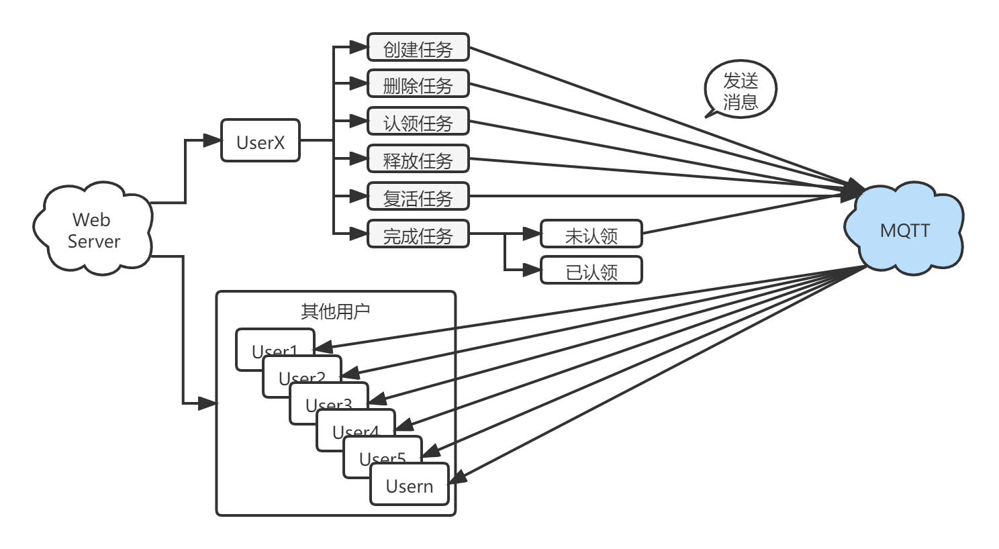

# 任务看板产品方案介绍

### 1、产品名称

任务看板。

### 2、使用MQTT实现哪些功能

通过MQTT推送实现任务创建、任务认领、任务释放、任务完成等信息的同步，从而实现团队云协作。


### 3、代码示例

* #### MQTT初始化
```javascript
function mqttInit(){
    clientId = deviceId +'_'+ new Date().getTime()+'@' + appId
    console.log(clientId);
    mqtt = new Paho.MQTT.Client(host,port,clientId);
    mqtt.onMessageArrived = function(message) {
        if(JSON.parse(message.payloadString)['from'] !==user ) {
            data = ((JSON.parse(message.payloadString))['value']);
            data = JSON.parse(data);
            action = JSON.parse(message.payloadString)['action'];
            swal({
                title: JSON.parse(message.payloadString)['from'],
                text: "更新了任务看板:"+actionList[action],
                timer: 2000
              });
            saveDate(data,'0',flag=1);
            load();
        }
    }
    mqtt.onConnectionLost  = function(message){
    	console.log('连接已丢失：'+user+','+clientId);
    }
    mqtt.onMessageDelivered  = function(message){
    	console.log('消息发送成功');
    }
    console.log('mqtt客户端初始化成功');
}
```
* #### 获取token
```javascript
function mqttToken(){
    _this = this;
    var params = {
         "grant_type":'client_credentials',
         "client_id": client_id,
         "client_secret": client_secre
    };
 var result = false;
 $.ajax({
     url:baseUrl+'/'+orgName+'/'+appName+'/token',
     data:JSON.stringify(params),
     type:'post',
     dataType:'json',
     async:false,
     success:function (response) {
     	result = true
         _this.accessToken = response.access_token;
            password = response.access_token;
         console.log('accessToken获取成功：'+password);
     },
     error:function (response) {
         _this.accessToken = '';
            password = '';
         result = false;
         console.log('accessToken获取失败,response='+response);
     }
 });
 return result;
}
```
* #### 新用户注册
```javascript
function mqttRegister(uname,passwd){
	var _this = this;
	var params = [
			{
				"password": uname,
				"username": passwd
			}
		];
	var result = false;
	$.ajax({
		url:baseUrl+'/'+orgName+'/'+appName+'/users',
		data:JSON.stringify(params),
		type:'post',
		dataType:'json',
		headers: {
			Authorization: "Bearer "+_this.accessToken
		},
		async:false,
		success:function (response) {
			console.log('用户注册成功，user='+user);
			console.log(response);
			result = true;
		},
		error:function (response) {
			console.log('用户注册失败，user='+user);
			 console.log(response);
			result = false;
		}
	});
	return result;
}
```
* #### 用户登录
```javascript
function mqttLogin(uname,passwd){
	var params = {
		"grant_type":'password',
		"password": uname,
		"username": passwd
	};
	$.ajax({
		url:baseUrl+'/'+orgName+'/'+appName+'/token',
		data:JSON.stringify(params),
		type:'post',
		dataType:'json',
		async:false,
		success:function (response) {
			token = response.access_token;
			result = true;
			console.log('用户登录成功，user='+user+',token='+token);
		},
		error:function (response) {
			token = '';
			result = false;
			console.log('用户登录失败，user='+user);
		}
	});
	username = uname;
	password = passwd;
	return result;
}
```
* #### 连接MQTT服务并发送消息
```javascript
function mqttConnect(){
    var options = {
     // timeout : 3,//timeout,
     mqttVersion : 4,//mqttVersion,
     cleanSession : true,//cleanSession,
     useSSL : false,//useTLS,
     userName : user, 
     password : token,
     onSuccess: function(message){
         console.log('服务器连接成功');
            mqttSubscribe()
     },
     onFailure: function (message) {
         console.log('服务器连接失败');
         console.log(message);
         // setTimeout(mqttConnect(), reconnectTimeout);
     }
    }
	mqtt.connect(options);
}
```
* #### MQTT服务订阅
```javascript
function mqttSubscribe(){
	mqtt.subscribe(topic, { qos: 2 });
	console.log('订阅成功');
}
```
* #### MQTT服务取消订阅
```javascript
function mqttUnsubscribe(){
	mqtt.unsubscribe(topic)
	console.log('取消订阅成功');
}
```
* #### 发送消息
```javascript
function mqttSend(topic,message){
	if(!mqtt.isConnected()){
		mqttConnect();
	}
	mqttSubscribe();
	message = new Paho.MQTT.Message(message)
	message.destinationName = topic
	mqtt.send(message);
	console.log('消息发送成功');
}
```
### 4、部署说明：

#### 修改配置

去MQTT控制台创建应用后，在index.js中完善以下参数即可：

```javascript
var mqtt
// 设置当前用户的接入点域名，进入console控制台获取
const host = 'xxxxxx.cn1.mqtt.chat'
// WebSocket 协议服务端口，如果是走 HTTPS，设置443端口
const port = 80
// 从console控制台获取
const appId = 'xxxxxx' 
// MQTT 用户自定义deviceID
var deviceId = 'xxxxx'+user
// clientId 格式 deviceID@AppID
var clientId = deviceId +'_'+ new Date().getTime()+'@' + appId
const client_id = 'xxxxxxxxxxx-xxxxxx-xxxxxx'
const client_secre = 'xxxxxxxx_xxxxxxxxx_xxxxxxxxxxxxxxxxx'
// 是否走加密 HTTPS，如果走 HTTPS，设置为 true
const useTLS = false
// cleansession标志
const cleansession = true
// 超时重连时间
const timeout = 3
const reconnectTimeout = 4000 
const mqttVersion = 4 
const baseUrl = "http://a3.easemob.com"
const orgName = "xxxxxxxxxxxxxxxxxxx"
const appName = "xxxx"
// 用户密码为第一步中申请的token
var password = ''
// 需要订阅或发送消息的topic名称
var topic = 't/xxxxx'
```
#### 服务部署

直接放到Nginx、Apache、IIS等web容器即可访问。
